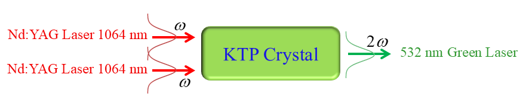

## 🧰 How to Use This Template    

Click the green **"Use this template"** button at the top of the page, then choose **"Create a new repository"**.   

This will create your own copy of this project, which you can modify freely — no need to fork!   

 
<p align="center">
  
</p>


<h1 align="center">SHG-CW-G-Coupled</h1>

<div align="center">

| **Term** | **Definition** |
|----------|----------------|
| **SHG** | Second Harmonic Generation |
| **CW** | Continuous Wave |
| **G** | Gaussian |
</div>

&nbsp;

<div align="center">

Article title:       
**Heat coupled Gaussian continuous-wave double-pass type-II second harmonic generation: inclusion of thermally induced phase mismatching and thermal lensing**
</div>

&nbsp;

---

***Table of Contents***

<div>
  &nbsp;&nbsp;&nbsp;&nbsp;<a href="#1-about-this-repository"><i><b>1. About this repository</b></i></a>
</div>
&nbsp;

<div>
  &nbsp;&nbsp;&nbsp;&nbsp;<a href="#2-getting-started"><i><b>2. Getting Started</b></i></a>
</div>
&nbsp;

<div>
  &nbsp;&nbsp;&nbsp;&nbsp;<a href="#3-how-to-cite-us"><i><b>3. How to Cite Us</b></i></a>
</div>
&nbsp;


<div>
  &nbsp;&nbsp;&nbsp;&nbsp;<a href="#4-contact-information"><i><b>4. Contact Information</b></i></a>
</div>
&nbsp;

---    

## 1. About this repository

This repository contains the **Toolkit for Modeling of 3D Temperature Distribution in KTP Crystal: Continuous-Wave Gaussian Second Harmonic Generation**, an open-source toolkit for modeling the thermal dynamics that underpin continuous-wave second-harmonic generation (CW SHG), using KTP as a case study.

### Toolkit Overview

The toolkit provides comprehensive modules for geometry and material definitions of KTP crystals, boundary and cooling models with various heat transfer mechanisms, and transient and steady-state finite-difference solvers for temperature field computation.

The toolkit supports parameterized scenario sweeps including temperature-dependent versus constant thermal conductivity, convection with and without radiation boundary conditions, and heat-transfer coefficients spanning 6.5–2.0×10⁴ W·m⁻²·K⁻¹. It features compiled Fortran kernels with built-in benchmark reporting, reproducible pipelines with versioned code repository, and exportable datasets with spatiotemporal temperature fields. The toolkit generates both radial and axial temperature profiles for comprehensive analysis.

The implementation has been validated by reproducing temperature distributions and trends for KTP under Gaussian CW pumping, including the effects of temperature-dependent conductivity and boundary conditions. This toolkit was used to solve the thermal modeling problem described in the research article **"Temperature Distribution in a Gaussian End-Pumped Nonlinear KTP Crystal: the Temperature Dependence of Thermal Conductivity and Radiation Boundary Condition"**.


```
Folder PATH listing
+---citation                    <-- Reference documents and citations
│       1_Heat-Equation_Continu… <-- Heat equation analytical solution
│       2_Heat-Equation_Continu… <-- Heat equation continuous wave
│       3_Heat-Equation_Pulsed-… <-- Heat equation pulsed wave
│       4_Phase-Mismatch_Pulsed… <-- Phase mismatch analysis
│       5_Ideal_Continuous-Wave… <-- Ideal continuous wave study
│       6_Ideal_Pulsed-Wave_Bes… <-- Ideal pulsed wave Bessel
│       7_Coupled_Continuous-Wa… <-- Coupled continuous wave
│       README.md               <-- Citation documentation
│
+---images                      <-- Visual assets and graphics
│       SHG-banner.png          <-- Project banner image
│
+---results                     <-- Computational output data
│       Psi_12_m_r.plt          <-- Psi field mode 12 minus radial
│       Psi_12_m_z.plt          <-- Psi field mode 12 minus axial
│       Psi_12_p_r.plt          <-- Psi field mode 12 plus radial
│       Psi_12_p_z.plt          <-- Psi field mode 12 plus axial
│       Psi_22_m_r.plt          <-- Psi field mode 22 minus radial
│       Psi_22_m_z.plt          <-- Psi field mode 22 minus axial
│       Psi_22_p_r.plt          <-- Psi field mode 22 plus radial
│       Psi_22_p_z.plt          <-- Psi field mode 22 plus axial
│       Psi_32_m_r.plt          <-- Psi field mode 32 minus radial
│       Psi_32_m_z.plt          <-- Psi field mode 32 minus axial
│       Psi_32_p_r.plt          <-- Psi field mode 32 plus radial
│       Psi_32_p_z.plt          <-- Psi field mode 32 plus axial
│       ST_85_time_01_p_r.plt   <-- ST time series pressure radial
│       ST_85_time_01_p_t.plt   <-- ST time series pressure theta
│       ST_85_time_01_p_z.plt   <-- ST time series pressure axial
│       ST_85_time_01_T_r.plt   <-- ST time series temperature radial
│       ST_85_time_01_T_t.plt   <-- ST time series temperature theta
│       ST_85_time_01_T_z.plt   <-- ST time series temperature axial
│
+---src                         <-- Source code and implementation
│       Code_SHG-CW-G-Coupled.… <-- Main Fortran simulation code
│
│       Article_SHG-CW-G-Coupl… <-- Main research article PDF
│       CITATION.cff            <-- Citation metadata file
│       LICENSE                 <-- Project license information
│       README.md               <-- Project documentation
```

## 2. Getting Started

### 2.1. Prerequisites
- **Fortran Compiler** (gfortran, Intel Fortran, or similar)
- **Text Editor** (VS Code, Cursor, or any Fortran-capable editor)
- **PDF Reader** (for accessing research papers and documentation)
- **Git** (for cloning the repository)
- **Make** (for building the project, optional but recommended)

### 2.2. Quick Start

1. **Clone the repository**
   ```bash
   git clone https://github.com/Second-Harmonic-Generation/SHG-CW-G-Fields-Coupled.git
   cd SHG-CW-G-Fields-Coupled
   ```

2. **Explore the Research Papers**
   - Open `Article_SHG-CW-G-Coupled.pdf` for the main research article
   - Review the `citation/` folder for supporting references
   - Read the `README.md` files in each subdirectory for detailed explanations

3. **Compile and Run the Code**
   ```bash
   cd src/
   gfortran -o shg_simulation Code_SHG-CW-G-Coupled.f90
   ./shg_simulation
   ```

4. **Analyze Results**
   - Check the `results/` folder for generated plot data files (.plt format)
   - Use your preferred plotting software to visualize the results
   - Compare with the theoretical predictions in the research papers

5. **Development Workflow**
   - Edit the Fortran source code in `src/Code_SHG-CW-G-Coupled.f90`
   - Modify parameters as needed for your specific analysis
   - Recompile and run to generate new results
   - Document your findings and modifications


## 3. How to Cite Us
Please refer to the [**citation**](./citation/) folder for accurate citations. It contains essential guidelines for accurate referencing, ensuring accurate acknowledgement of our work.


  
## 4. Contact Information

For questions not addressed in the resources above, please connect with [Mostafa Rezaee](https://www.linkedin.com/in/mostafa-rezaee/) on LinkedIn for personalized assistance.
